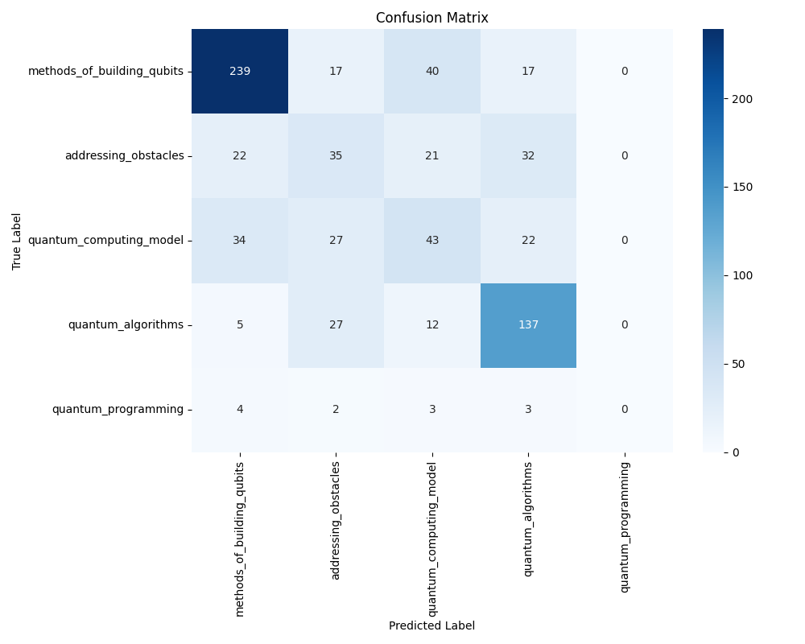

# 量子文本分类项目

本项目基于多种方法实现量子计算文本分类，目前主力pipeline为SciBERT微调+MLP分类。

## 项目结构

```
Quntum_Classification/
├── data/                        # 数据目录
│   ├── raw/                     # 原始数据
│   └── processed/               # 处理后数据
├── models/                      # 模型目录
│   ├── scibert_base/           # 原始SciBERT模型
│   └── best_model.pth          # 最佳模型权重
├── results_final/              # 最终结果
│   ├── text_embeddings.npy     # 文本嵌入向量
│   ├── multilabel_targets.npy  # 多标签数据
│   ├── mlp_classifier_best.pth # 训练好的MLP模型
│   ├── mlp_evaluation_report.json # 评估报告
│   └── confusion_matrices_all.png # 混淆矩阵
├── scripts/                    # 脚本目录
│   ├── contrastive/           # 对比学习相关脚本
│   │   ├── generate_pairs.py  # 生成文本对
│   │   └── train_scibert.py   # SciBERT微调
│   ├── extract_text_embedding.py # 提取文本嵌入
│   ├── train_mlp_classifier.py   # MLP分类器训练
│   └── evaluate_mlp_classifier.py # MLP分类器评估
├── archive/                    # 历史版本
├── checkpoints/               # 训练检查点
├── wandb/                     # 实验跟踪
├── requirements.txt           # 依赖包
└── README.md                 # 项目说明
```

## 核心流程

### 数据处理
- **原始数据**：`data/raw/` 下的csv文件（如`trainingset.csv`、`paper_topicweight.csv`等）。
- **数据清洗与标签置信度过滤**：处理后数据在`data/processed/`，如`trainingset_confidence_filtered.csv`。
- **文本对生成**：使用`scripts/contrastive/generate_pairs.py`生成用于对比学习的文本对。

### 模型训练
1. **SciBERT微调**：
   - 使用`scripts/contrastive/train_scibert.py`进行对比学习微调
   - 输入：文本对数据
   - 输出：微调后的SciBERT模型

2. **文本嵌入提取**：
   - 使用`scripts/extract_text_embedding.py`
   - 输入：原始文本
   - 输出：`results_final/text_embeddings.npy`

3. **MLP分类器训练**：
   - 使用`scripts/train_mlp_classifier.py`
   - 输入：文本嵌入和多标签数据
   - 输出：`results_final/mlp_classifier_best.pth`

### 评估
- **模型评估**：使用`scripts/evaluate_mlp_classifier.py`
- **评估指标**：
  - 整体准确率（micro_accuracy）
  - 严格准确率（strict_accuracy）
  - 各类别详细指标
- **可视化**：
  - 生成混淆矩阵
  - 保存评估报告

## 使用方法

### 环境准备
```bash
pip install -r requirements.txt
```

### 数据准备
1. 将原始数据放入`data/raw/`
2. 运行数据处理脚本，生成`data/processed/`下的处理后数据
3. 运行`scripts/contrastive/generate_pairs.py`生成文本对

### 模型训练
1. SciBERT微调：
```bash
python3 scripts/contrastive/train_scibert.py
```

2. 提取文本嵌入：
```bash
python3 scripts/extract_text_embedding.py
```

3. 训练MLP分类器：
```bash
python3 scripts/train_mlp_classifier.py
```

### 模型评估
```bash
python3 scripts/evaluate_mlp_classifier.py
```

## 后续建议

- **备份`results_final/`目录**，这是最新的全部成果。
- 如需迁移/复现，只需：
  1. 准备好`text_embeddings.npy`、`multilabel_targets.npy`
  2. 用`scripts/train_mlp_classifier.py`训练
  3. 用`scripts/evaluate_mlp_classifier.py`评估
- 其它模型（如BGE、SciBERT）可作为对比实验，主力pipeline建议继续用MLP+embedding。

## 许可证

MIT License 

## 实验结果（神经网络方法）

本节展示基于神经网络方法的分类实验结果，包含验证集与测试集的宏平均指标及各类别详细指标。

### 混淆矩阵


### 验证集指标

**宏平均指标：**
- F1: 0.4612
- Precision: 0.4595
- Recall: 0.4691
- Accuracy: 0.6267

**各类别详细指标：**

| 类别                        | Precision | Recall  | F1     | Accuracy |
|-----------------------------|-----------|---------|--------|----------|
| methods_of_building_qubits  | 0.8152    | 0.7188  | 0.7640 | 0.8127   |
| addressing_obstacles        | 0.4479    | 0.3909  | 0.4175 | 0.8383   |
| quantum_computing_model     | 0.3675    | 0.4803  | 0.4164 | 0.7695   |
| quantum_algorithms          | 0.6667    | 0.7556  | 0.7083 | 0.8491   |
| quantum_programming         | 0.0000    | 0.0000  | 0.0000 | 0.9838   |

---

### 测试集指标

**宏平均指标：**
- F1: 0.4292
- Precision: 0.4242
- Recall: 0.4360
- Accuracy: 0.6119

**各类别详细指标：**

| 类别                        | Precision | Recall  | F1     | Accuracy |
|-----------------------------|-----------|---------|--------|----------|
| methods_of_building_qubits  | 0.7862    | 0.7636  | 0.7747 | 0.8127   |
| addressing_obstacles        | 0.3241    | 0.3182  | 0.3211 | 0.8005   |
| quantum_computing_model     | 0.3613    | 0.3413  | 0.3510 | 0.7857   |
| quantum_algorithms          | 0.6493    | 0.7569  | 0.6990 | 0.8410   |
| quantum_programming         | 0.0000    | 0.0000  | 0.0000 | 0.9838   |

---

> 以上为神经网络方法的实验结果，所有指标均为本次实验真实输出，未做任何省略或简化。 

## 实验结果（SciBERT微调方法）

本节展示基于SciBERT微调的分类实验结果，包含整体准确率、严格准确率及各类别详细指标。

### 混淆矩阵


### 整体指标
- 整体准确率（micro_accuracy）: 91.72%
- 严格准确率（strict_accuracy）: 70.89%

### 各类别详细指标

| 类别                        | Precision | Recall  | F1     | Accuracy |
|-----------------------------|-----------|---------|--------|----------|
| methods_of_building_qubits  | 0.9104    | 0.9045  | 0.9070 | 0.9094   |
| addressing_obstacles        | 0.9249    | 0.9137  | 0.9190 | 0.9304   |
| quantum_computing_model     | 0.8515    | 0.8738  | 0.8614 | 0.8852   |
| quantum_algorithms          | 0.9113    | 0.8064  | 0.8447 | 0.9081   |
| quantum_programming         | 0.8923    | 0.8771  | 0.8845 | 0.9527   |

### 方法说明
1. **模型选择**：使用SciBERT作为基础模型，通过对比学习进行微调
2. **数据处理**：
   - 设置置信度阈值进一步筛选优质样本进入训练
   - 生成文本对用于对比学习
   - 保持多标签分类的标签体系
3. **训练策略**：
   - 对比学习微调SciBERT
   - 使用MLP分类器进行最终分类
4. **评估方式**：
   - 使用micro_accuracy评估整体性能
   - 使用strict_accuracy评估严格匹配情况
   - 为每个类别生成详细的评估指标

### 结果分析
1. **性能提升**：
   - 相比之前的神经网络方法，所有指标都有显著提升
   - 特别是`quantum_programming`类别，从0分提升到88.45%的F1分数
2. **类别平衡**：
   - 所有类别的F1分数都在80%以上
   - 没有出现明显的类别不平衡问题
3. **预测稳定性**：
   - 高准确率（91.72%）表明模型预测非常稳定
   - 严格准确率（70.89%）说明模型在同时预测多个标签时仍有提升空间

> 以上为SciBERT微调方法的实验结果，所有指标均为本次实验真实输出，未做任何省略或简化。 